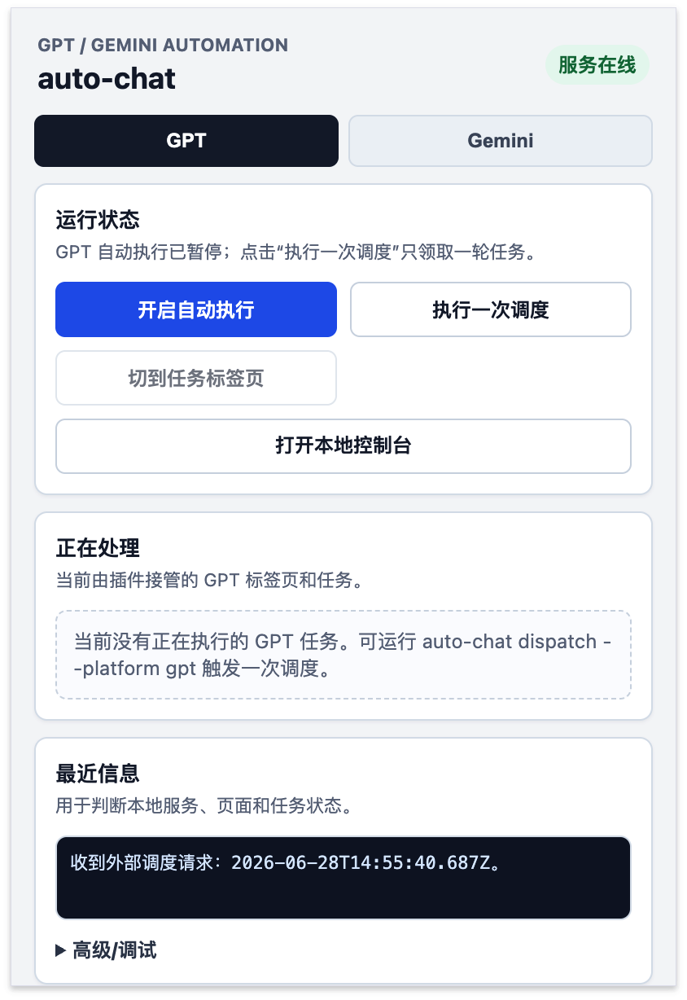
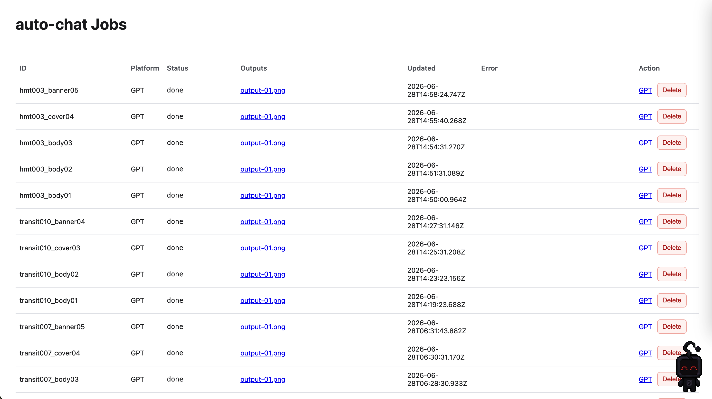

# auto-chat

<div align="center">

## GPT/Gemini 浏览器自动化工具

**零 API Key，零凭据，本地运行——用你自己的 ChatGPT/Gemini 页面自动化任务。**

[](https://www.npmjs.com/package/auto-chat-cli)
[](LICENSE)
[](https://github.com/leo-306/auto-chat)

[English](README.en.md) · [Agent 集成协议](docs/agent-integration.md) · [Skill 文档](skills/auto-chat/SKILL.md)

</div>

---

auto-chat 是一个本地 GPT/Gemini 浏览器自动化工具。它用本地服务管理任务队列和文件，用 Chrome 插件接管你自己已登录的 ChatGPT 或 Gemini 页面，再通过 CLI、SSE 和本地文件把结果交还给 Agent 或脚本。

它适合这些场景：

- 让 Codex、Claude Code、Cursor Agent 等本地 Agent 调用 GPT/Gemini 页面完成任务。
- 批量提交图片生成、图片理解、文本问答任务，并把结果保存成本地文件。
- 在不暴露账号凭据、不接管网页状态判断的前提下，把浏览器里的 AI 能力接成本地自动化流程。
- 为自己的内容生产、素材生成、测试和工作流系统做二次开发。

## 核心卖点

- **本地优先**：任务、输入图片、输出文件默认都在仓库 `data/` 目录，不需要远端任务平台。
- **支持 GPT 和 Gemini**：同一套 CLI 可以调度两个平台，任务 JSON 里用 `platform` 区分。
- **文本和图片都支持**：`mode: "text"` 输出 `output-01.txt`，`mode: "image"` 输出 `output-01.*` 等图片文件。
- **Agent 友好**：提供 `auto-chat dispatch/listen/doctor/open`，Agent 不需要直接操作浏览器 DOM。
- **指定任务调度**：推荐 `auto-chat dispatch --platform gemini <jobId>`，避免同平台旧任务被误领取。
- **可监听、可诊断、可重试**：SSE 实时推送任务状态，失败后可 `doctor`、`retry` 或 `open` 人工接管。
- **持久化标签页**：任务设置 `persistTab: true`，完成后不自动关闭浏览器标签页，方便后续复用。
- **续对话（多轮）**：新任务指定 `parentJobId`，插件直接复用父任务的已有标签页，在同一对话线程追加发送，GPT 和 Gemini 均支持。
- **Gemini 图文输入稳定处理**：参考图直接粘贴到 Gemini 输入框，等待发送按钮解除禁用后再提交。
- **文本结果复制更可靠**：通过页面复制按钮采集文本，剪贴板里 `auto-chat` 开头的旧命令会被忽略。

## 工作方式

```text
Agent / CLI / 脚本
  -> auto-chat 本地服务 127.0.0.1:17321
  -> Chrome MV3 插件
  -> ChatGPT / Gemini 页面
  -> data/jobs/<jobId>/outputs/
```

auto-chat 不托管 GPT/Gemini 账号，不保存登录凭据，也不绕过平台登录或权限机制。浏览器页面仍然使用你自己的登录态。

插件 popup 控制面板：



## 快速开始

### 让 Agent 帮你安装

如果你在使用 Claude Code、Codex 或 Cursor 等 Agent，可以直接用自然语言发起安装：

```text
帮我安装 https://github.com/leo-306/auto-chat 这个工具，包括 CLI 和 Chrome 插件，装完后启动服务。
```

Agent 会自动完成 npm 安装、`auto-chat init`、插件引导等步骤。

### 手动安装

安装 CLI：

```bash
npm install -g auto-chat-cli
```

初始化本地服务和 Agent skill：

```bash
auto-chat init
```

`auto-chat init` 会启动后台服务、打开 Chrome 扩展管理页，并打印插件下载地址、本机 zip 路径和安装引导。按提示解压 [auto-chat-extension.zip](auto-chat-extension.zip)，在 [chrome://extensions](chrome://extensions) 里启用 Developer mode 后选择 Load unpacked。

安装 Chrome 插件：

1. 下载或找到 [auto-chat-extension.zip](auto-chat-extension.zip)。
2. 解压到一个固定目录。
3. 打开 [chrome://extensions](chrome://extensions)，启用 Developer mode。
4. 点击 Load unpacked，选择解压后的目录。

任务列表页面：`http://127.0.0.1:17321/`



后续服务管理：

```bash
auto-chat status
auto-chat start
auto-chat stop
```

插件默认暂停，不会自动领取队列。可以在 popup 里点击"执行一次调度"，也可以用 CLI 触发。

## Agent 集成

### Codex 示例

把本仓库的 skill 安装到 Codex skill 目录，或使用：

```bash
auto-chat init
```

`auto-chat init` 会安装 agent skill、启动本地服务，并提示 Chrome 插件安装步骤。

然后在 Codex 中直接发起任务请求，例如：

```text
使用 auto-chat 帮我用 Gemini 生成一张赛博朋克风格的猫咪头像，完成后把图片文件路径发给我。
```

Codex 应通过 auto-chat 的本地 CLI、SSE 和输出文件完成任务。


### Claude Code 示例

把本仓库的 skill 安装到 Claude Code skill 目录，或使用：

```bash
auto-chat init
```

`auto-chat init` 会安装 agent skill、启动本地服务，并提示 Chrome 插件安装步骤。

Claude Code 侧可以直接给这样的请求：

```text
使用 auto-chat 帮我用 ChatGPT 生成一张白色极简风的咖啡店室内效果图，完成后告诉我图片保存在哪里。
```

Claude Code 调用示例（Gemini 生图任务全流程）：


### 其他 Agent / 脚本

HTTP 创建调度信号：

```bash
curl -X POST http://127.0.0.1:17321/dispatch \
  -H 'content-type: application/json' \
  --data '{"platform":"gemini","jobId":"gemini_text_test_001"}'
```

监听事件流：

```text
GET http://127.0.0.1:17321/events
```

完整协议见 [docs/agent-integration.md](docs/agent-integration.md)。

## 常用命令

```bash
auto-chat start
auto-chat status
auto-chat stop

auto-chat add <job.json> [--replace] [--auto-id]
auto-chat add <job.json> --platform gpt
auto-chat add <job.json> --platform gemini

auto-chat list
auto-chat show <jobId>
auto-chat show <jobId> --json

auto-chat dispatch
auto-chat dispatch --platform gpt
auto-chat dispatch --platform gemini
auto-chat dispatch --platform gpt <jobId>
auto-chat dispatch --platform gemini <jobId>

auto-chat concurrency
auto-chat concurrency 3

auto-chat listen [jobId]
auto-chat listen [jobId] --json
auto-chat doctor <jobId>
auto-chat retry <jobId>
auto-chat reload <jobId>
auto-chat open <jobId>
```

推荐 Agent 和脚本使用：

```bash
auto-chat dispatch --platform <gpt|gemini> <jobId>
```

这样插件会领取指定任务，避免同平台更早排队的任务被误触发。

插件调度最大并发数默认是 1。需要同时处理多个任务时，可以查看或设置并发数：

```bash
auto-chat concurrency
auto-chat concurrency 3
```

并发数范围是 1 到 8，设置后会写入本地服务配置，插件下一轮调度会按新值领取任务。

## 第一个任务(命令式调用)

创建 GPT 文本任务：

```bash
auto-chat add examples/text-job.json --replace
auto-chat dispatch --platform gpt text_test_001
auto-chat listen text_test_001
```

完成后读取：

```text
data/jobs/text_test_001/outputs/output-01.txt
```

创建 Gemini 文本任务：

```bash
auto-chat add examples/gemini-text-job.json --replace
auto-chat dispatch --platform gemini gemini_text_test_001
auto-chat listen gemini_text_test_001
```

创建图片任务：

```bash
auto-chat add examples/job.json --replace
auto-chat dispatch --platform gpt img_order_test_002
auto-chat listen img_order_test_002
```

图片会写入：

```text
data/jobs/<jobId>/outputs/output-01.*
data/jobs/<jobId>/outputs/output-02.*
```

## 任务类型

### 文本任务

```json
{
  "id": "text_test_001",
  "platform": "gpt",
  "mode": "text",
  "prompt": "请用一句话介绍一下太阳系。",
  "sourceImages": []
}
```

Gemini 文本任务只需要把 `platform` 改为 `gemini`：

```json
{
  "id": "gemini_text_test_001",
  "platform": "gemini",
  "mode": "text",
  "prompt": "请用一句话介绍一下你自己。",
  "sourceImages": []
}
```

文本结果优先通过页面的复制响应按钮采集。若剪贴板内容以 `auto-chat` 开头，会被视为旧命令文本并忽略，插件会继续等待真实响应复制结果。

### 带参考图的文本任务

```json
{
  "id": "gemini_text_image_001",
  "platform": "gemini",
  "mode": "text",
  "prompt": "请识别并简要说明这张图片的内容。",
  "sourceImages": ["/absolute/path/to/input.png"]
}
```

GPT 和 Gemini 都支持 `sourceImages`。Gemini 不走文件选择器，插件会把图片直接粘贴到输入框，等待发送按钮解除禁用后提交。

### 持久化标签页与续对话

任务完成后默认关闭标签页。如果你需要在同一对话线程追加发送，可以：

1. 创建父任务时设置 `persistTab: true`，完成后标签页保留。
2. 续对话任务指定 `parentJobId`，插件优先复用父任务的已有标签页；若标签页已关闭则回退用父任务的 `conversationUrl` 打开。

```json
{
  "id": "parent_001",
  "platform": "gpt",
  "mode": "text",
  "prompt": "请用一句话介绍一下太阳系。",
  "sourceImages": [],
  "persistTab": true
}
```

```json
{
  "id": "followup_001",
  "platform": "gpt",
  "mode": "text",
  "prompt": "刚才你提到太阳系，请再用一句话介绍一下银河系。",
  "sourceImages": [],
  "parentJobId": "parent_001",
  "persistTab": true
}
```

GPT 和 Gemini 均支持。续对话任务不新建会话，直接在原对话线程追加 prompt，AI 可以看到上下文。

### 图片任务

```json
{
  "id": "img_order_test_002",
  "platform": "gpt",
  "mode": "image",
  "prompt": "生成一张图，要求严格按顺序：红色裙子。每张图人物一致。",
  "expectedImageCount": 1,
  "sourceImages": []
}
```

### Gemini 多图任务

Gemini 一次对话只生成一张图片。多图任务推荐使用 `prompts` 数组，每个元素描述一张图：

```json
{
  "id": "gemini_img_test_001",
  "platform": "gemini",
  "mode": "image",
  "prompt": "生成两张人物一致的单人裙装图片。",
  "prompts": [
    "一位亚洲女生穿红色连衣裙，站在街边咖啡店外，真实生活摄影，单人半身到全身构图，画面只包含这一张图片。",
    "同一位亚洲女生穿蓝色连衣裙，坐在咖啡店窗边，真实生活摄影，单人半身构图，画面只包含这一张图片。"
  ],
  "expectedImageCount": 2,
  "sourceImages": []
}
```

插件会按数组顺序串行生成，并保存为 `output-01.*`、`output-02.*`。

## 输出与状态判断

文本输出：

```text
data/jobs/<jobId>/outputs/output-01.txt
```

图片输出：

```text
data/jobs/<jobId>/outputs/output-01.*
data/jobs/<jobId>/outputs/output-02.*
```

图片顺序规则：

- GPT 按页面生图卡片顺序采集，并按 estuary `file_...` 去重。
- Gemini 多图任务按串行轮次采集。
- `events.jsonl` 里会写入 `image_order` 事件确认顺序。

状态判断：

```text
done -> 成功，读取 outputs
failed_retryable -> 可 auto-chat retry <jobId>
已有对话 URL 且只需重新加载检查 -> 可 auto-chat reload <jobId>
needs_manual / failed_final -> auto-chat open <jobId>
stalled / refreshing -> 继续 auto-chat listen <jobId>
其他状态 -> 运行中
```

诊断：

```bash
auto-chat doctor <jobId>
auto-chat show <jobId>
cat data/jobs/<jobId>/events.jsonl
```

## 源码二开

仓库结构：

```text
apps/server      本地 Fastify 服务、CLI、任务存储、SSE
apps/extension   Chrome MV3 插件、页面自动化、结果采集
packages/shared  共享类型、协议 schema、提示词辅助逻辑
examples         示例任务 JSON
skills/auto-chat Agent skill
docs             集成协议文档
```

开发命令：

```bash
npm install
npm run build
npm run check
npm test
```

开发调试建议：

- 改插件或共享协议后运行 `npm run build`，并在 Chrome 里重新加载 `apps/extension/dist`。
- 服务必须通过 `auto-chat start` / `auto-chat stop` 管理，不建议直接跑 `node apps/server/dist/index.js`。
- 真实任务流请使用全局 `auto-chat` CLI，不要把浏览器页面当成主状态源。
- 修改任务协议、状态机或 HTTP API 时，同步更新 [docs/agent-integration.md](docs/agent-integration.md) 和 [skills/auto-chat/SKILL.md](skills/auto-chat/SKILL.md)。

打包安装：

```bash
npm run build
npm pack
npm install -g ./auto-chat-cli-*.tgz
auto-chat init
```

打包 Chrome 插件 zip：

```bash
npm run pack:extension
```

生成的 `auto-chat-extension.zip` 根目录会直接包含 `manifest.json`，需要随代码一起提交，供用户从 GitHub 下载后解压安装。

## 安全边界

- auto-chat 只自动化你自己 Chrome 里已登录的 GPT/Gemini 页面。
- 不保存平台账号密码或 cookie。
- 不绕过平台限制、验证码、登录或权限机制。
- 默认任务数据写入本地 `data/`，该目录不应提交到 Git。
